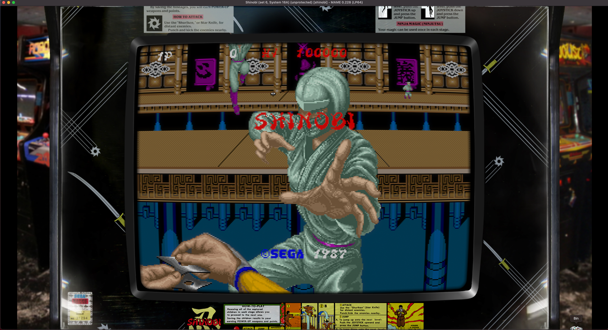

# MAME-Realistic-Bezel-Artwork

**Important Update as of January 2021:**
* updated all lay files to new format
* clean-up of all bezels completed
* screen mask to all bezels added
* screen bezels added to selected artwork (e.g. shinobi)

These Arcade Bezels provide the impression of (more or less heavily) used arcade machines, which I particularly like. Most of these bezels were produced by John Merrit, Ars Invictus and Orions Angel.

### Parallel Retroarch Repository (John Merrit's originals):

I maintain a parallel repository for Retroarch overlays here:
https://github.com/estefan3112/Retroarch-Realistic-Bezel-Artwork/blob/master/README.md
They contain a full set of John Merrit's Realistic Bezels that he originally produced for Retroarch.

## What you find here:

1. Artwork for the official MAME distribution, which is an adaptation of John Merrit's artworks for RetroArch/Retropie:
https://forums.libretro.com/t/arcade-overlays/4084
NOTE: I will not transfer all of John Merrit's artwork for Retroach at any time, but I will pick and choose.

2. Further artwork from Orionsangel as discussed here:
https://forums.libretro.com/t/my-realistic-arcade-bezels/10604
These .lay files aim to be platform independent and bare bone (with exceptions, where choice is nice).

3. Selected 4k artwork from ArsInvictus:
https://forums.libretro.com/t/new-4k-bezel-overlays/25247
He now focuses on vertical overlays, while I remain with horizontal ones.

4. I also included a template default.lay file, from which it is easy to build new layouts.

Explained for MAME on my Blog for MAME on modern Macs:
https://mameonmacs.blogspot.co.at/2017/02/porting-retropie-artwork-to-official.html

### My own main contributions to this repository are:

(1) All bezels stay in their original scale, mostly 1080p. No need for adjustments, since MAME automatically scales artwork.

(2) I typically **split these MAME bezels into cabinet and screen**, so that you can **switch between Clear Screen and Scratch Screen** inside the game. It is a showcase for MAME's great bezel design. If the screen is too blurry or too clear for you, note that all screens have an alpha value, which you can edit in the default.lay file. Thereby you can make the screen more or less transparent. Apparently, this does not apply to the Clear Screen setting, where there is no screen overlay at all.

(3) This repository aims to be **platform independent**. MAME .lay files should work all over systems, whereas Retroarch needs dedicated config files for every system.

(4) I **manually smoothened the screen borders** - a lot of work, completed for all bezels here. If John Merrit's bezels require refinement, then these are the screen borders. See yourself.

(5) **Lay file updated to new version**: see detailed explaination below.

(6) All bezels received a **Screen Mask**, which provides a significant quality improvement for my personal taste. In some cases (e.g. shinobi), I additionally implemented a dedicated **Screen Bezel** on top, so that the bezel looks more realistic.

### A general note as regards Screen Size in these Layout files:
As explained to me by John in a post, nearly all traditional Cabinet monitors are 4:3 aspect ratio. Even if the game provides for a different internal screen resolution, they were displayed in 4:3. Although this results in distortion in some games, only this seems to provide the view of the original. Where the bezel artwork does not respect the 4:3 aspect ratio, I needed to compromise.

### Also, do not forget to zip the folders into .zip files as soon as you are happy with them.

## Important update January 2021: new layout format as of MAME 0.225

Throughout 2020, the MAME layout format has been revamped. As of version 0.225, the 'old' layout files produce a warning in the Terminal, such as
"Warning: layout view 'Upright_Artwork' contains deprecated bezel element."
The required updates in my layout files are (mostly) trivial, and I will update gradually all layout files. For MAME versions < v0.225, I will retain the old version under the filename 'old-default.lay', which you obviously have to rename to 'default.lay' in order to work.

Required changes to my lay files spotted so far (still exploring):
(1) Replace <bezel element> and </bezel> by <element ref> and </element>
(2) In each view, the order matters now. So screen must be first and then overlapping bezels.
(3) Old Overlay Elements now need blend="multiply" as element attribute
(4) Old Backdrop Elements nw need blend="add" as element attribute
Very helpful explanations by Mr. Do: https://mrdo.mameworld.info - post of November 22, 2020.

# W.I.P. - stay tuned

This repository will be steady work in progress, more artwork to arrive. Have a look into the commit history to find out, this is no steady progress.

ALL WORK DONE HERE IS LICENSED UNDER GPL FOR FURTHER FREE USE.
